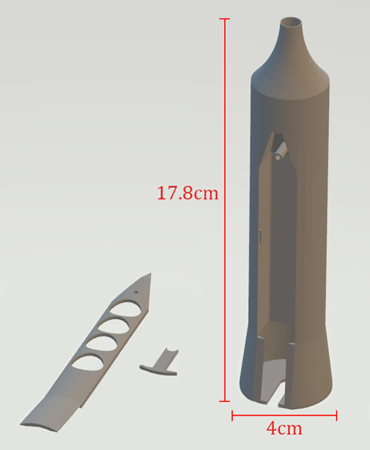
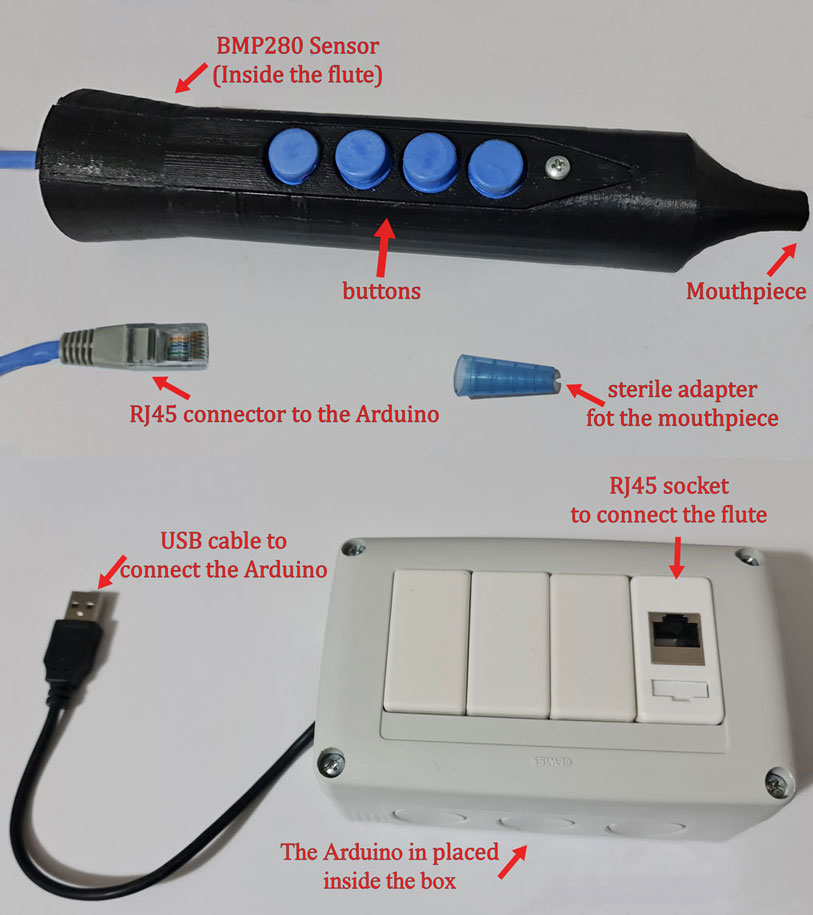
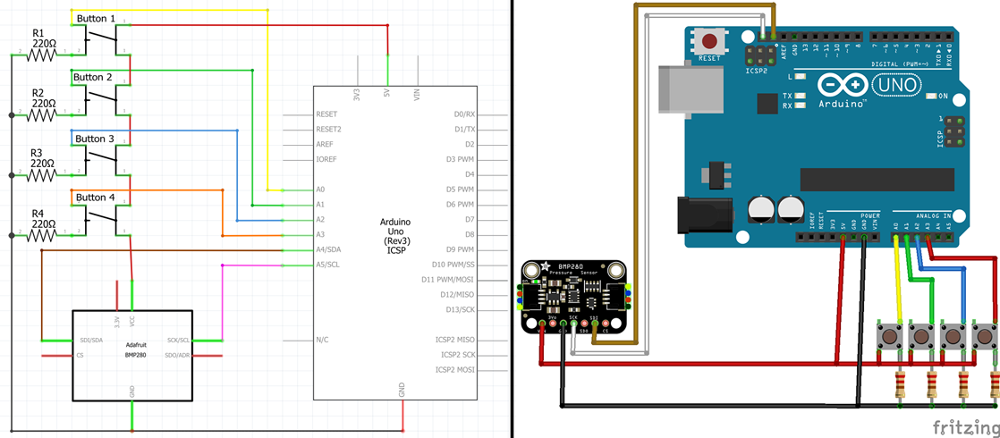

# MagicFlute
## About

This project is the final product of the course "Human-Computer Interaction" of the Hebrew University of Jerusalem.
The project was carried out in collaboration with [ALYN Hospital](https://www.alyn.org.il/), which attends children in rehabilitation processes.
The goal was to make a breathing game, which will be used by children who need breathing training. Although the game is suitable for children, it can be used by people of all ages.
The game features a breathing challenge, which combines fun tasks as will be described below.

In the project we implemented a virtual agent and a physical agent using the following tools:
we modeled a 3D flute for printing, created electrical circuits that connect to an Arduino Uno, and created communication between the Arduino and the GUI (Graphic User Interface) where the game runs.

## Physical Agent
### The flute
We modeled a flute-like object with the program [Rhino 6](https://www.rhino3d.com/download/archive/rhino/6/latest/), which used for 3D modeling.
The flute is the game's controller, with 4 buttons on it and a mouthpiece through which the user exhales into the flute.
The flute consists of 3 parts that were printed separately, and were connected with a screw and some rails.

### Electric circuit
Inside the flute, we put a [BMP280](https://learn.adafruit.com/adafruit-bmp280-barometric-pressure-plus-temperature-sensor-breakout) (barometric pressure and temperature sensor) which measures the intensity of the exhalation.
On top of the flute we put 4 buttons, which sense the user clicks on them.

From the end of the flute comes an electrical cable that connects the buttons and the sensor to the box inside which the Arduino is located.
The connection to the box is made with a RJ45 connector. This way, the flute can be easily connected and disconnected from the Arduino.
The arduino is connected to the computer with a USB cable, and it reads the buttons signals and the BMP pressure output as his input.

### Human physical interface
The user needs to blow the flute and press the buttons simultaneously, according to the instructions in the computer screen (described below).
When he does that, the sensor measures his breathing and the buttons detect the presses, and the signals are sent to the computer via the Arduino.
The game can be adjusted to a difficulty level that the user chooses which determines the exhalation intensity, and includes an option to play without buttons (only with blowing). 

## Virtual Agent
### Player interface
We built the game GUI using the program [Processing 4](https://processing.org/download).
It is a musical game - the user chooses a song, and then "notes" begin to fall towards a flute drawing.
The player needs to press the right buttons while the notes reach the flute holes.
If he failed to press on time, the note will pop when it touches the flute.
If he succeeds, the note will get "inside" the flute.
While the notes are inside the flute, they begin to slowly disappear. The player needs to "blow" them out of the flute.
Each note that got out successfully earns the player 10 points. 
The goal is to blow all the notes out, and get the maximal level score.

#### Menus
In all the pages, there is an exit button `X`.
* In the main menu, the user can choose a level which describes as the name of the song, and the difficulty.
Also, he can choose to play without buttons. In addition, there is an option to go to the instructions page.
* The instructions menu contains explanations about how to play the game and how to use the menus.
* The level contains the option to quit at any time and go back to the main menu.
* When the level ends, the level-end menu appears with the user score, and a button to return to the main menu.
The user score represented as 5 stars that fills accordingly.

### Attendant's tools
The attendant has extra tools that help him track the player’s progress.
* He can add levels. The levels are written as json-list files, that can be easily written and added to the [level's directory](MagicFluteGame/levels).
To add the level to the game, he can update the [levels.json](MagicFluteGame/levels.json) file with its details.
Finally, he can add the song file into the [music directory](MagicFluteGame/music).
* At the end of each level, a document is created in a log's directory with the exhalation intensities received by the BMP280 sensor.
It prints an intensity sample every second, with the sampling time.

## Program
With the processing software we wrote the GUI to the game, with 4 files:
1. [MagicFluteGame](MagicFluteGame/MagicFluteGame.pde) - the main of the game.
2. [menus](MagicFluteGame/menus.pde) - maintains the menus logics.
3. [gameClass](MagicFluteGame/gameClass.pde) - class of the levels.
4. [noteClass](MagicFluteGame/noteClass.pde) - class of the level's notes.

The processing indentify the Arduino device while connecting.
We used the [Minim](https://github.com/ddf/Minim) library of processing to play the music.
We created two-sided serial connection between the Arduino and the processing program.
In a process of a level, the Arduino sends the BMP280 current pressure and the buttons state consistently (once in a constant time) to processing with this connection.
In addition, the processing sends calibrations commands to the arduino as long there are no notes "inside" the flute.
The calibrations are designed to maintain the pressure measured inside the flute.

## Usage
1. Close this project.
2. Print the [3D model](src/fluteFirstPrint.stl) of the flute, and compound all it's pieces together as described (include the BMP280, the buttons and the cables).
3. Connect the electronic parts of the Arduino as described above (include the box).
4. Install the Processing and the Arduino IDE programs.
5. Install the libraries from the [requirements.txt](readme/requirements.txt) file ([Adafruit Bus IO Library](https://github.com/adafruit/Adafruit_BusIO), [Adafruit BMP280 Driver](https://github.com/adafruit/Adafruit_BMP280_Library) and [Minim](https://github.com/ddf/Minim))
6. Flush the [Arduino sketch](ArduinoCode/ArduinoCode.ino) into the Arduino Uno device.
7. Update the [.bat file](MagicFlute.bat), as described inside it.
8. Run the program by pressing the [.bat file](MagicFlute.bat).
9. Connect the Arduino to the computer to start the game.
10. Enjoy! :slightly_smiling_face:
